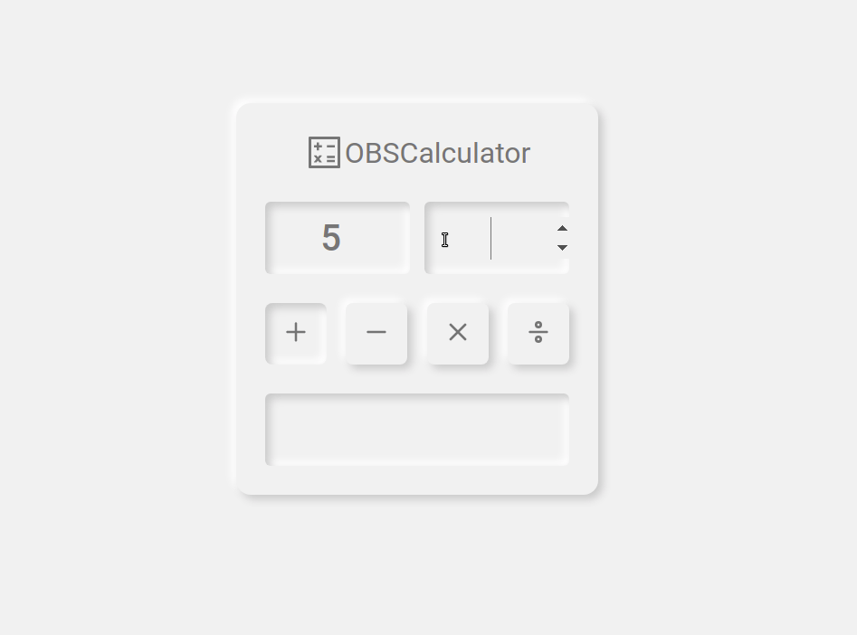

## OBS Calc

<h4 align="center">
  Desafio 01 - O desafio consiste na implementação de um calculadora simples, que realiza operações de dois números.
</h4>



## Tecnologias
  
- [ReactJS](https://reactjs.org/)
- [Typescript](https://www.typescriptlang.org/)

```bash
$ git clone https://github.com/LauroCosta/OBSCalc---Desafio-01 && cd OBSCalc---Desafio-0
```

**Siga os passos abaixo**

```bash
# Instale as dependências
$ yarn

# Execute o servidor que simula um back-end
$ yarn server

# Execute o servidor web
$ yarn dev
```

O aplicativo estará disponível para acesso em seu navegador em `http://localhost:3000`


---